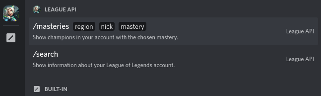
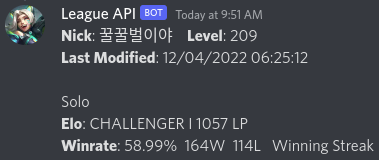
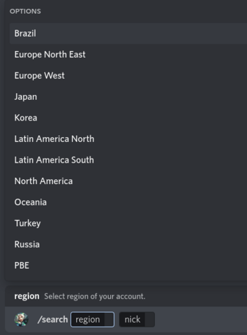

# League of Legends API Bot
A Discord bot that uses Riot API. 

Display info about your account, such as: 
- Account level
- Stats for ranked solo, flex and tft: Elo, winrate (wins and losses), winstreak and miniseries.
- Show champions of accout by mastery.

## How to install
1. Install [Go](https://go.dev/doc/install)
1. Clone this repository: `git clone https://github.com/bingbr/League-API-Bot.git`
1. Put your [Riot Games API Token](https://developer.riotgames.com/) in [/league/init.go > tokenRiot](/league/init.go)
1. Put your [Discord Bot Token](https://discord.com/developers/applications) in [/discord/init.go > tokenDiscord](/discord/init.go)
1. Open repository with Terminal/CMD.
1. Run `go run main.go`

## Print

### Made with:
* [GO](https://go.dev/)
* [DiscordGo](https://github.com/bwmarrin/discordgo)
* [FastHTTP](https://github.com/valyala/fasthttp)